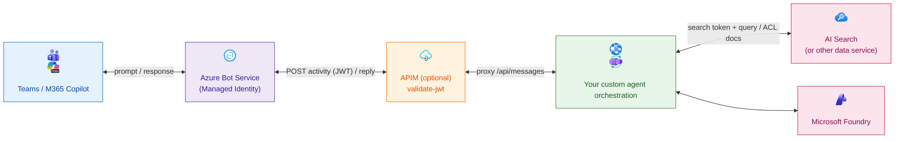

# Agents SDK Accelerator for M365 Copilot and Teams

## Why this project exists

Organizations want to give their teams a smart assistant that lives right inside the tools they already use every day — Microsoft 365 Copilot and Microsoft Teams — instead of yet another separate app to learn and open.

A lot of organizations have already built their own custom agents or agent orchestrations, but they are often not integrated with Microsoft 365 Copilot and Teams. This means employees have to leave the tools they are already using to get answers from the assistant, which is a poor experience and reduces adoption.

This accelerator shows how to build such an assistant and make it show up natively in Copilot and Teams.

<!-- Diagram source: docs/mermaids/generic-architecture-overview.mmd (regenerate the PNG with mermaid-cli) -->

The goal of this accelerator is to give teams a ready-made starting point they can adapt to their own needs, so they can go from idea to a secure, company-wide assistant much faster — without having to figure out all the plumbing from scratch.

This project is demonstrating how a custom agent or agent orchestration made with any kind of Python Framework such as Microsoft Agent Framework, LangChain, or any other framework can be integrated with Microsoft 365 Copilot and Teams using the M365 Agents SDK. 

Additionally, to demonstrate the usage of the user token, it also shows how to implement per-user document access control through Azure AI Search and Entra security groups.

## High-level architecture

For the detailed sequence diagram, the production/development comparison and the per-mode
diagrams, see [docs/ARCHITECTURE.md](./docs/ARCHITECTURE.md).

## Documentation

Follow the guides in order to go from zero to a published agent:

| Guide | What it covers |
|---|---|
| [Architecture](./docs/ARCHITECTURE.md) | Sequence diagram, production vs development comparison, and high-level architecture diagrams |
| [Authentication](./docs/AUTHENTICATION.md) | How authentication works. Bot Service ↔ agent code, user SSO, and per-user document ACLs |
| [Getting started](./docs/GETTING_STARTED.md) | Prerequisites, Azure sign-in, and `azd provision` |
| [Data and search](./docs/DATA_AND_SEARCH.md) | Setup the Entra security groups, `.env`, and seeding the AI Search index to run this accelerator from end to end|
| [Run and deploy](./docs/RUN_AND_DEPLOY.md) | Production vs development modes, `azd deploy`, manifest build, and Teams publishing |
| [Mermaid generation](./docs/MERMAID_GENERATION.md) | Regenerating the architecture diagrams |

## References

- [M365 Agents SDK](https://learn.microsoft.com/microsoft-365/agents-sdk/agents-sdk-overview)
- [Agent Framework (Python)](https://github.com/microsoft/agent-framework)
- [AI Search Document-Level ACLs](https://learn.microsoft.com/azure/search/search-document-level-access-overview)
- [Query-Time ACL Enforcement](https://learn.microsoft.com/azure/search/search-query-access-control-rbac-enforcement)
- [Bot Connector Authentication](https://learn.microsoft.com/azure/bot-service/rest-api/bot-framework-rest-connector-authentication)
- [APIM validate-jwt Policy](https://learn.microsoft.com/azure/api-management/validate-jwt-policy)
- [Azure Architecture Icons](https://learn.microsoft.com/azure/architecture/icons/)
- [Microsoft 365 Architecture Icons](https://learn.microsoft.com/previous-versions/microsoft-365/solutions/architecture-icons-templates)

## Disclaimer

This sample scripts are not supported under any Microsoft standard support program or service. The sample script is provided AS IS without warranty of any kind. Microsoft further disclaims all implied warranties including, without limitation, any implied warranties of merchantability or of fitness for a particular purpose. The entire risk arising out of the use or performance of the sample scripts and documentation remains with you. In no event shall Microsoft, its authors, or anyone else involved in the creation, production, or delivery of the scripts be liable for any damages whatsoever (including, without limitation, damages for loss of business profits, business interruption, loss of business information, or other pecuniary loss) arising out of the use of or inability to use the sample scripts or documentation, even if Microsoft has been advised of the possibility of such damages.

