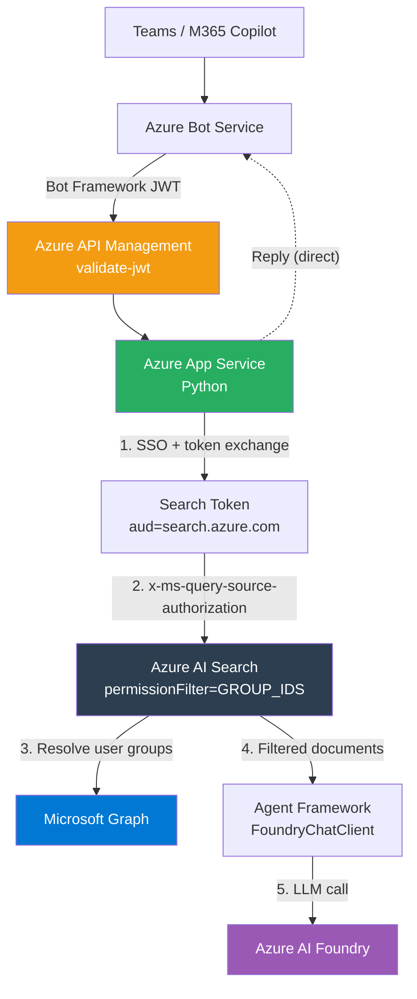

# M365 Copilot Pro Code Approach

## Disclaimer

This sample scripts are not supported under any Microsoft standard support program or service. The sample script is provided AS IS without warranty of any kind. Microsoft further disclaims all implied warranties including, without limitation, any implied warranties of merchantability or of fitness for a particular purpose. The entire risk arising out of the use or performance of the sample scripts and documentation remains with you. In no event shall Microsoft, its authors, or anyone else involved in the creation, production, or delivery of the scripts be liable for any damages whatsoever (including, without limitation, damages for loss of business profits, business interruption, loss of business information, or other pecuniary loss) arising out of the use of or inability to use the sample scripts or documentation, even if Microsoft has been advised of the possibility of such damages.

This project is an M365 Agent Application built with Python and the Microsoft Agent Framework, deployable to Azure using the Azure Developer CLI (`azd`). It demonstrates how to build a secure enterprise agent with per-user document access control through Azure AI Search and Entra security groups.

## Architecture



See [docs/architecture.md](docs/architecture.md) for the full detailed architecture.

## Prerequisites

- [Azure Developer CLI (azd)](https://learn.microsoft.com/azure/developer/azure-developer-cli/install-azd)
- [Azure CLI](https://learn.microsoft.com/cli/azure/install-azure-cli)
- [Python 3.13+](https://www.python.org/downloads/)
- [uv](https://docs.astral.sh/uv/)
- An Azure subscription with access to Azure AI Foundry, AI Search, and API Management
- A Microsoft 365 tenant with Teams/Copilot access

## Azure Authentication

Before provisioning or deploying, authenticate with Azure:

```bash
az login --use-device-code
azd auth login --use-device-code
```

## Azure Provisioning & Deployment

### Provision and deploy

```bash
azd up
```

This provisions all Azure resources (App Service, Bot Service, API Management, AI Search, Foundry, app registrations, OAuth connections) and deploys the Python application.

> You can also run `azd provision` and `azd deploy` separately.

### Per-user document access control

This project uses Azure AI Search with Entra group-based document permissions. To set it up:

1. **Create Entra security groups and add users:**

```bash
az ad group create --display-name "SG-ProjectManagers" --mail-nickname "sg-projectmanagers"
az ad group create --display-name "SG-Marketing" --mail-nickname "sg-marketing"

az ad group member add --group "<group-id>" --member-id "<user-object-id>"
```

2. **Grant admin consent for AI Search permissions:**

```bash
az ad app permission admin-consent --id $(azd env get-values | grep AAD_APP_CLIENT_ID | cut -d'"' -f2)
```

3. **Seed the AI Search index with demo documents:**

```bash
cd src/m365_agent_app
echo 'DEMO_GROUP_PM_ID=<pm-group-id>' >> .env
echo 'DEMO_GROUP_MKTG_ID=<marketing-group-id>' >> .env
python ../../scripts/seed_search_index.py
```

4. **Sideload the app in Teams/Copilot:**

Upload the manifest from `appPackage/` in Teams → Apps → Manage your apps → Upload a custom app.

## Configuration

All configuration is via environment variables. See [`.env.template`](src/m365_agent_app/.env.template).

| Variable | Description | Set by |
|----------|-------------|--------|
| `CONNECTIONS__SERVICE_CONNECTION__*` | Bot identity (UAMI) | `azd provision` |
| `AGENTAPPLICATION__USERAUTHORIZATION__HANDLERS__SEARCH__*` | Search token handler | `azd provision` |
| `AZURE_SEARCH_ENDPOINT` | AI Search endpoint | `azd provision` |
| `MS_FOUNDRY_PROJECT_ENDPOINT` | Foundry project endpoint | `azd provision` |
| `DEMO_GROUP_PM_ID` | Entra group ID for PM documents | Manual (`.env`) |
| `DEMO_GROUP_MKTG_ID` | Entra group ID for Marketing documents | Manual (`.env`) |

## Local Development

### 1. Install dependencies

```bash
cd src/m365_agent_app
uv sync
```

### 2. Activate the virtual environment

```bash
source .venv/bin/activate
```

### 3. Run the application

```bash
uv run python main.py
```

### 4. Test with Teams App Test Tool

```bash
teamsapptester
```

## Project Structure

```
src/m365_agent_app/
  app.py                    # Bot handler — SSO, token acquisition, message routing
  main.py                   # Entry point — starts the aiohttp server
  agents/
    orchestrator.py          # Agent + FoundryChatClient + SecureSearchContextProvider
    constants.py             # Tool name labels
  tools/
    secure_search.py         # Context provider with per-user ACL filtering
  utils/
    auth.py                  # Token acquisition helper
    streaming.py             # Streaming response helper
  bootstrap/
    server.py                # aiohttp server with JWT middleware
scripts/
  seed_search_index.py       # Creates AI Search index + demo documents with group ACLs
infra/
  main.bicep                 # All Azure resources (App Service, Bot, APIM, AI Search, Foundry)
  modules/                   # Bicep modules (APIM, bot, security, search, foundry)
```

## References

- [M365 Agents SDK](https://learn.microsoft.com/microsoft-365/agents-sdk/agents-sdk-overview)
- [Agent Framework (Python)](https://github.com/microsoft/agent-framework)
- [AI Search Document-Level ACLs](https://learn.microsoft.com/azure/search/search-document-level-access-overview)
- [Query-Time ACL Enforcement](https://learn.microsoft.com/azure/search/search-query-access-control-rbac-enforcement)
- [Bot Connector Authentication](https://learn.microsoft.com/azure/bot-service/rest-api/bot-framework-rest-connector-authentication)
- [APIM validate-jwt Policy](https://learn.microsoft.com/azure/api-management/validate-jwt-policy)
