# M365 Copilot Pro Code Approach

## Disclaimer

This sample scripts are not supported under any Microsoft standard support program or service. The sample script is provided AS IS without warranty of any kind. Microsoft further disclaims all implied warranties including, without limitation, any implied warranties of merchantability or of fitness for a particular purpose. The entire risk arising out of the use or performance of the sample scripts and documentation remains with you. In no event shall Microsoft, its authors, or anyone else involved in the creation, production, or delivery of the scripts be liable for any damages whatsoever (including, without limitation, damages for loss of business profits, business interruption, loss of business information, or other pecuniary loss) arising out of the use of or inability to use the sample scripts or documentation, even if Microsoft has been advised of the possibility of such damages.

This project is an M365 Agent Application built with Python and the Microsoft Agent Framework, deployable to Azure using the Azure Developer CLI (`azd`).

## Architecture

```mermaid
flowchart LR
    User["Teams / M365 Copilot"] --> Bot["Bot Service"]
    Bot -->|"BF JWT"| APIM["APIM<br/>validate-jwt"]
    APIM --> App["App Service"]
    App -->|"1. SSO"| SSO["User JWT<br/>aud=bot-app-id"]
    SSO -->|"2. OBO"| OBO["Search Token<br/>aud=search.azure.com"]
    OBO -->|"3. x-ms-query-source-<br/>authorization"| Search["AI Search<br/>permissionFilter=GROUP_IDS"]
    Search -->|"4. Graph resolves<br/>user groups"| Graph["Microsoft Graph"]
    Search -->|"5. Filtered docs"| Agent["Agent Framework<br/>FoundryChatClient"]
    Agent -->|"6. LLM"| Foundry["Azure AI Foundry"]
    App -.->|"Reply (direct)"| Bot

    style APIM fill:#f39c12,color:#fff
    style App fill:#27ae60,color:#fff
    style Search fill:#2c3e50,color:#fff
    style Foundry fill:#9b59b6,color:#fff
    style Graph fill:#0078d4,color:#fff
```



See [docs/architecture.md](docs/architecture.md) for the full detailed architecture with SSO sequence diagrams, APIM policies, and network security.

## Prerequisites

- [Azure Developer CLI (azd)](https://learn.microsoft.com/azure/developer/azure-developer-cli/install-azd)
- [Azure CLI](https://learn.microsoft.com/cli/azure/install-azure-cli)
- [Python 3.13+](https://www.python.org/downloads/)
- [uv](https://docs.astral.sh/uv/)
- An Azure subscription with access to Azure AI Foundry, AI Search, and APIM
- A Microsoft 365 tenant with Teams/Copilot access

## Azure Authentication

Before provisioning or deploying, authenticate with Azure:

```bash
az login --use-device-code
azd auth login --use-device-code
```

## Azure Provisioning & Deployment

### Provision infrastructure

```bash
azd provision
```

This will provision all the required Azure resources defined in the `infra/` folder.

### Deploy the application

```bash
azd deploy
```

This will package and deploy the Python application to the provisioned Azure App Service.

> You can also run `azd up` to provision and deploy in a single command.

## Per-User Document Access Control (AI Search)

This project demonstrates per-user document filtering using Azure AI Search with native Entra group-based ACLs.

### 1. Create Entra security groups

```bash
az ad group create --display-name "SG-ProjectManagers" --mail-nickname "sg-projectmanagers"
az ad group create --display-name "SG-Marketing" --mail-nickname "sg-marketing"

az ad group member add --group "<pm-group-id>" --member-id "<user-object-id>"
az ad group member add --group "<marketing-group-id>" --member-id "<user-object-id>"
```

### 2. Grant admin consent

```bash
az ad app permission admin-consent --id $(azd env get-values | grep AAD_APP_CLIENT_ID | cut -d'"' -f2)
```

### 3. Seed the AI Search index

```bash
cd src/m365_agent_app

# Add group IDs to .env
echo 'DEMO_GROUP_PM_ID=<pm-group-object-id>' >> .env
echo 'DEMO_GROUP_MKTG_ID=<marketing-group-object-id>' >> .env

python ../../scripts/seed_search_index.py
```

### 4. Sideload in Teams/Copilot

Upload the app manifest from `appPackage/` in Teams → Apps → Manage your apps → Upload a custom app.

### How it works

1. SSO gives a user token (`aud=bot-app-id, scp=access_as_user`)
2. MSAL OBO exchanges it for a search token (`aud=search.azure.com`) via `OBO_CONNECTION`
3. The search token is passed to AI Search via `x_ms_query_source_authorization`
4. AI Search resolves the user's Entra groups via Microsoft Graph
5. Only documents where `group_ids` matches the user's groups are returned

### Customization

- **Documents**: edit `scripts/seed_search_index.py` with your own content and `group_ids`
- **Groups**: create Entra groups, add users, reference group Object IDs in documents
- **Model**: update `MS_FOUNDRY_ORCHESTRATOR_MODEL_DEPLOYMENT_NAME` in App Service settings

## Configuration

All configuration is via environment variables. See [`.env.template`](src/m365_agent_app/.env.template).

| Variable | Description | Set by |
|----------|-------------|--------|
| `CONNECTIONS__SERVICE_CONNECTION__SETTINGS__CLIENTID` | UAMI client ID | `azd provision` |
| `CONNECTIONS__OBO_CONNECTION__SETTINGS__CLIENTID` | App registration ID (OBO) | `azd provision` |
| `CONNECTIONS__OBO_CONNECTION__SETTINGS__CLIENTSECRET` | App registration secret | `postprovision` hook |
| `AZURE_SEARCH_ENDPOINT` | AI Search endpoint | `azd provision` |
| `MS_FOUNDRY_PROJECT_ENDPOINT` | Foundry project endpoint | `azd provision` |
| `DEMO_GROUP_PM_ID` | Entra group ID for PM docs | Manual (`.env`) |
| `DEMO_GROUP_MKTG_ID` | Entra group ID for Marketing docs | Manual (`.env`) |

## Local Development

### 1. Install dependencies

```bash
cd src/m365_agent_app
uv sync
```

### 2. Activate the virtual environment

```bash
source .venv/bin/activate
```

### 3. Run the application

```bash
uv run python main.py
```

### 4. Test with Teams App Test Tool

```bash
teamsapptester
```

## References

- [M365 Agents SDK](https://learn.microsoft.com/microsoft-365/agents-sdk/agents-sdk-overview)
- [Agent Framework (Python)](https://github.com/microsoft/agent-framework)
- [AI Search Document-Level ACLs](https://learn.microsoft.com/azure/search/search-document-level-access-overview)
- [Query-Time ACL Enforcement](https://learn.microsoft.com/azure/search/search-query-access-control-rbac-enforcement)
- [MSAL OBO Flow](https://learn.microsoft.com/entra/identity-platform/v2-oauth2-on-behalf-of-flow)
- [APIM validate-jwt Policy](https://learn.microsoft.com/azure/api-management/validate-jwt-policy)