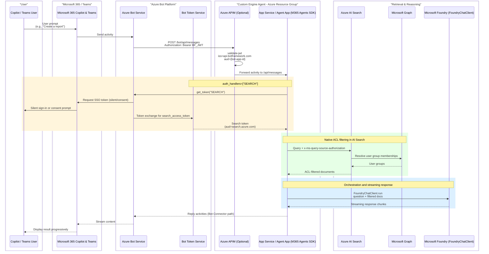

# M365 Copilot Pro Code Approach

## Disclaimer

This sample scripts are not supported under any Microsoft standard support program or service. The sample script is provided AS IS without warranty of any kind. Microsoft further disclaims all implied warranties including, without limitation, any implied warranties of merchantability or of fitness for a particular purpose. The entire risk arising out of the use or performance of the sample scripts and documentation remains with you. In no event shall Microsoft, its authors, or anyone else involved in the creation, production, or delivery of the scripts be liable for any damages whatsoever (including, without limitation, damages for loss of business profits, business interruption, loss of business information, or other pecuniary loss) arising out of the use of or inability to use the sample scripts or documentation, even if Microsoft has been advised of the possibility of such damages.

##  Architecture

This project is an M365 Agent Application built with Python and the Microsoft Agent Framework, deployable to Azure using the Azure Developer CLI (`azd`). It demonstrates how to build a secure enterprise agent with per-user document access control through Azure AI Search and Entra security groups.

## 📖 Summary

Follow the steps below to set up and run the project locally, deploy it to Azure, and integrate it with Microsoft Teams and M365 Copilot:

1) [Deploy the project to Azure](docs/deploy-project.md)
2) [Populate the Azure AI Search index with sample documents](docs/populate-ai-search-index.md)
3) [Deploy to Microsoft Teams and M365 Copilot](docs/deploy-to-teams-and-copilot-m365.md)

## References

- [M365 Agents SDK](https://learn.microsoft.com/microsoft-365/agents-sdk/agents-sdk-overview)
- [Agent Framework (Python)](https://github.com/microsoft/agent-framework)
- [AI Search Document-Level ACLs](https://learn.microsoft.com/azure/search/search-document-level-access-overview)
- [Query-Time ACL Enforcement](https://learn.microsoft.com/azure/search/search-query-access-control-rbac-enforcement)
- [Bot Connector Authentication](https://learn.microsoft.com/azure/bot-service/rest-api/bot-framework-rest-connector-authentication)
- [APIM validate-jwt Policy](https://learn.microsoft.com/azure/api-management/validate-jwt-policy)
