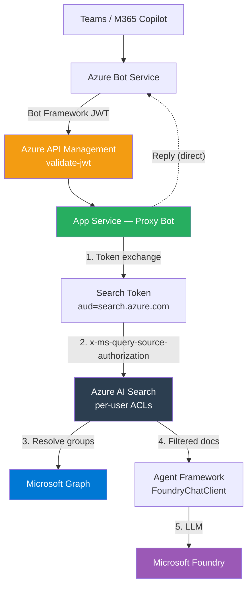

# M365 Copilot Pro Code Approach

## Disclaimer

This sample scripts are not supported under any Microsoft standard support program or service. The sample script is provided AS IS without warranty of any kind. Microsoft further disclaims all implied warranties including, without limitation, any implied warranties of merchantability or of fitness for a particular purpose. The entire risk arising out of the use or performance of the sample scripts and documentation remains with you. In no event shall Microsoft, its authors, or anyone else involved in the creation, production, or delivery of the scripts be liable for any damages whatsoever (including, without limitation, damages for loss of business profits, business interruption, loss of business information, or other pecuniary loss) arising out of the use of or inability to use the sample scripts or documentation, even if Microsoft has been advised of the possibility of such damages.

This project is an M365 Agent Application built with Python and the Microsoft Agent Framework, deployable to Azure using the Azure Developer CLI (`azd`). It demonstrates how to build a secure enterprise agent with per-user document access control through Azure AI Search and Entra security groups.

## Architecture



See [docs/architecture.md](docs/architecture.md) for the full detailed architecture.

## Prerequisites

- [Azure Developer CLI (azd)](https://learn.microsoft.com/azure/developer/azure-developer-cli/install-azd)
- [Azure CLI](https://learn.microsoft.com/cli/azure/install-azure-cli)
- [Python 3.13+](https://www.python.org/downloads/)
- [uv](https://docs.astral.sh/uv/)
- An Azure subscription with access to Microsoft Foundry, AI Search, and API Management
- A Microsoft 365 tenant with Teams/Copilot access

## Azure Authentication

Before provisioning or deploying, authenticate with Azure:

```bash
az login --use-device-code
azd auth login --use-device-code
```

## Azure Provisioning & Deployment

### Provision and deploy

```bash
azd provision
```

This provisions all Azure resources (App Service, Bot Service, API Management, AI Search, Microsoft Foundry, app registrations, OAuth connections) and deploys the Python application.

```bash
azd deploy
```


## Local Development

### 1. Install dependencies

```bash
cd src
uv sync
```

### 2. Activate the virtual environment

```bash
source .venv/bin/activate
```

### 3. Run the application

```bash
uv run python main.py
```

### 4. Test with Teams App Test Tool

```bash
teamsapptester
```

## References

- [M365 Agents SDK](https://learn.microsoft.com/microsoft-365/agents-sdk/agents-sdk-overview)
- [Agent Framework (Python)](https://github.com/microsoft/agent-framework)
- [AI Search Document-Level ACLs](https://learn.microsoft.com/azure/search/search-document-level-access-overview)
- [Query-Time ACL Enforcement](https://learn.microsoft.com/azure/search/search-query-access-control-rbac-enforcement)
- [Bot Connector Authentication](https://learn.microsoft.com/azure/bot-service/rest-api/bot-framework-rest-connector-authentication)
- [APIM validate-jwt Policy](https://learn.microsoft.com/azure/api-management/validate-jwt-policy)
