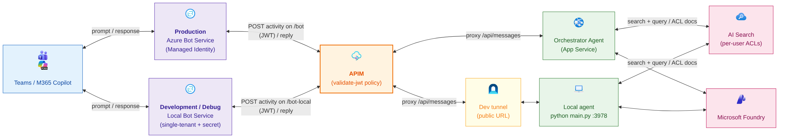

# Architecture

This project is an M365 Agent Application built with Python, the M365 Agents SDK and the
Microsoft Agent Framework, deployable to Azure using the Azure Developer CLI (`azd`). It
demonstrates how to build a secure enterprise agent that surfaces natively in Microsoft 365
Copilot and Teams, with per-user document access control through Azure AI Search and Entra
security groups.

For the authentication flows (Bot Service ↔ agent code, user SSO, per-user Search token),
see [AUTHENTICATION.md](./AUTHENTICATION.md).

## High-level architecture

<!-- Diagram source: docs/mermaids/architecture-overview.mmd (regenerate the PNG with mermaid-cli) -->

## Production vs Development / Debug configuration

The application can run in two modes:

- **Production** — deployed to Azure, real SSO + per-user ACLs.
- **Development / Debug** — local Bot Service + Dev tunnel, for breakpoints and fast iteration.

Each mode has its **own** bot identity **and its own SSO app registration** (federated
credentials, user sign-in, per-user Search ACLs); they only share the **same APIM gateway**.
What changes is **where the agent runs** and **which bot identity** fronts it. The
development mode adds a dedicated, single-tenant bot identity because a laptop cannot use
the managed identity that the deployed app relies on.

| Aspect | Production | Development / Debug |
|---|---|---|
| Where the agent runs | Azure App Service (Linux) | Your machine, exposed through a dev tunnel |
| Bot identity | User-assigned managed identity | Dedicated single-tenant app registration |
| How the bot proves its identity to Bot Service | Managed identity (no secret) | Client secret (minted locally) |
| Azure Bot Service resource | Production bot | Separate local bot |
| Messaging endpoint chain | APIM → App Service | APIM → dev tunnel → local agent |
| Teams manifest bot id | Production bot identity | Local bot app registration |
| User sign-in (SSO) app | Production SSO app (federated credentials) | Dedicated local SSO app (federated credentials) |
| Per-user Search token | OAuth connection on the production bot (production SSO app) | OAuth connection on the local bot (local SSO app) |
| Microsoft Foundry access | Managed identity | Your developer sign-in (`az login`) |
| Typical use | Real tenant rollout | Breakpoints and fast iteration |

> The Teams manifest's bot id must always match the Microsoft App ID configured on the
> Azure Bot Service it targets. In production that is the managed identity; in development
> it is the local single-tenant bot app registration. The SSO entry in the manifest
> (`webApplicationInfo`) points to the **production** SSO app in production and to the
> **dedicated local** SSO app in development — each environment is self-contained.

### Production architecture

<!-- Diagram source: docs/mermaids/architecture-production.mmd (regenerate the PNG with mermaid-cli) -->

### Development / Debug architecture

<!-- Diagram source: docs/mermaids/architecture-development.mmd (regenerate the PNG with mermaid-cli) -->
