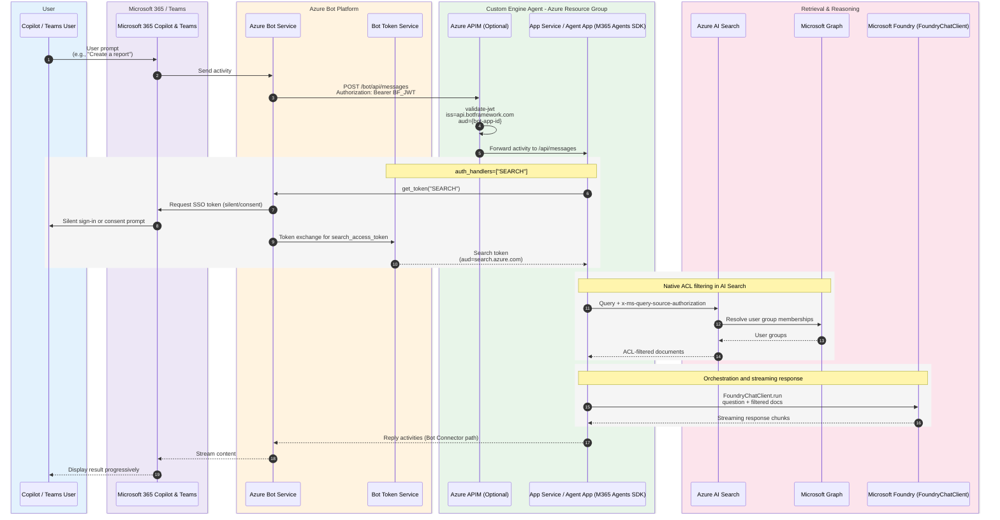

# Authentication

This accelerator involves **three distinct authentication flows**. Keeping them separate is
the easiest way to reason about security:

1. [Inbound — Bot Service → agent code](#1-inbound--bot-service--agent-code): how your agent
   trusts the request that reaches `/api/messages`, and how the bot proves its own identity to
   Azure Bot Service.
2. [User SSO → Search token (On-Behalf-Of)](#2-user-sso--search-token-on-behalf-of): how the
   agent obtains a per-user token scoped to Azure AI Search.
3. [Per-user document access (ACLs)](#3-per-user-document-access-acls): how AI Search returns
   only the documents the signed-in user is allowed to see.
4. [Detailed sequence diagram](#detailed-sequence-diagram): a complete end-to-end flow showing all three authentication flows in context.

See [ARCHITECTURE.md](./ARCHITECTURE.md) for the end-to-end sequence diagram.

## 1. Inbound — Bot Service → agent code

When a user talks to the agent in Teams or Copilot, the activity does **not** reach your code
directly. It flows through Azure Bot Service, then (optionally) through APIM, and only then to
your agent. Two things must be true for your code to trust that request.

### The request is signed and validated (APIM `validate-jwt`)

- Azure Bot Service sends the activity with an `Authorization: Bearer <JWT>` header.
- The token is issued by the Bot Framework (`iss=https://api.botframework.com`) and its
  audience is your bot's Microsoft App ID (`aud={bot-app-id}`).
- APIM enforces this with a `validate-jwt` policy **before** forwarding to your agent. Any
  request that is not a genuine, correctly-scoped Bot Service token is rejected at the gateway,
  so your agent code never processes unauthenticated traffic.

```text
Teams / Copilot → Bot Service → APIM (validate-jwt) → /api/messages (your agent)
                                 ^ rejects anything that isn't a valid JWT
```

> APIM is optional in principle, but it is the recommended place to enforce inbound validation
> so the agent app itself stays focused on business logic. See the
> [APIM validate-jwt policy](https://learn.microsoft.com/azure/api-management/validate-jwt-policy).

### The bot proves its own identity to Bot Service

The reverse direction matters too: when your agent replies (or requests a token), it must prove
it is the legitimate bot. How it does so depends on the mode:

| | Production | Development / Debug |
|---|---|---|
| Bot identity | User-assigned managed identity | Dedicated single-tenant app registration |
| Credential | Managed identity (no secret) | Client secret (minted locally by `gen_local_env.sh`) |
| Why | The deployed App Service can use a managed identity | A laptop cannot use the managed identity, so a local bot + secret is used instead |

<!-- TODO: link to the exact place in the code where the bot credentials / auth handler are
     wired (e.g. src/bootstrap/server.py and src/utils/auth.py) once finalized. -->

## 2. User SSO → Search token (On-Behalf-Of)

To retrieve documents **as the user** (not as the app), the agent needs a token scoped to Azure
AI Search that carries the user's identity.

- The agent declares an auth handler (`auth_handlers=["SEARCH"]`) and calls `get_token("SEARCH")`.
- Bot Service drives the SSO exchange with Microsoft 365 (silent sign-in or a consent prompt the
  first time).
- The Bot Token Service returns a token whose audience is `search.azure.com`.

This is what lets the next step enforce access **per user** instead of using a single app-wide
identity.

To achieve that, in the Bot Service, inside **Configuration** in the **OAuth Connection Settings**, you need to add the service provider that you want to use to request a token for. In this accelerator, you have:

- The AAD v2 with Federated Credentials with `api://botid-<your-bot-id>/access_as_user` to get the identity of the user. This is the token that will be used by the agent to act on behalf of the user.

- The AAD v2 with Federated Credentials with `https://search.azure.com/user_impersonation` to access the Azure AI Search service. This is the token that will be used to query the Azure AI Search service on behalf of the user.


As you can see above, you define a **Name** for each of the service providers, and you will use that name inside the .env file.

The Agent SDK has a convention to define the name of the service provider in the .env file, it's:

```python
AGENTAPPLICATION__USERAUTHORIZATION__HANDLERS__<YOUR_HANDLER_NAME>__SETTINGS__AZUREBOTOAUTHCONNECTIONNAME=the_name_of_the_service_provider_you_defined_in_the_bot_service
```

In this way, for instance for the Azure AI Search service provider of this accelerator, you will have the following line in the .env file:

```python
AGENTAPPLICATION__USERAUTHORIZATION__HANDLERS__SEARCH__SETTINGS__AZUREBOTOAUTHCONNECTIONNAME=search_access_token
```

The `search_access_token` is the name of the service provider that you defined in the Bot Service OAuth Connection Settings. And the `AGENTAPPLICATION__USERAUTHORIZATION__HANDLERS__SEARCH__SETTINGS__AZUREBOTOAUTHCONNECTIONNAME` is the name of the environment variable that you will use in the .env file to set the name of the service provider. `SEARCH` is the name of the handler that you will use in the code to get the token for the Azure AI Search service with an auth handler (`auth_handlers=["SEARCH"]`) or directly to calls `get_token("SEARCH")`.

## 3. Per-user document access (ACLs)

With the user's Search token in hand, the agent queries AI Search using native document-level
access control:

- The query includes the `x-ms-query-source-authorization` header carrying the user token like described previously.
- AI Search resolves the user's group memberships via Microsoft Graph.
- Only documents whose ACLs match the user's groups are returned; everything else is filtered
  out server-side.

Documents are tagged with Entra security group IDs (public documents use `group_ids=["all"]`).
See [DATA_AND_SEARCH.md](./DATA_AND_SEARCH.md) for how the index and ACLs are seeded.

## 4. Detailed sequence diagram



## References

- [Bot Connector Authentication](https://learn.microsoft.com/azure/bot-service/rest-api/bot-framework-rest-connector-authentication)
- [APIM validate-jwt Policy](https://learn.microsoft.com/azure/api-management/validate-jwt-policy)
- [AI Search Document-Level ACLs](https://learn.microsoft.com/azure/search/search-document-level-access-overview)
- [Query-Time ACL Enforcement](https://learn.microsoft.com/azure/search/search-query-access-control-rbac-enforcement)
