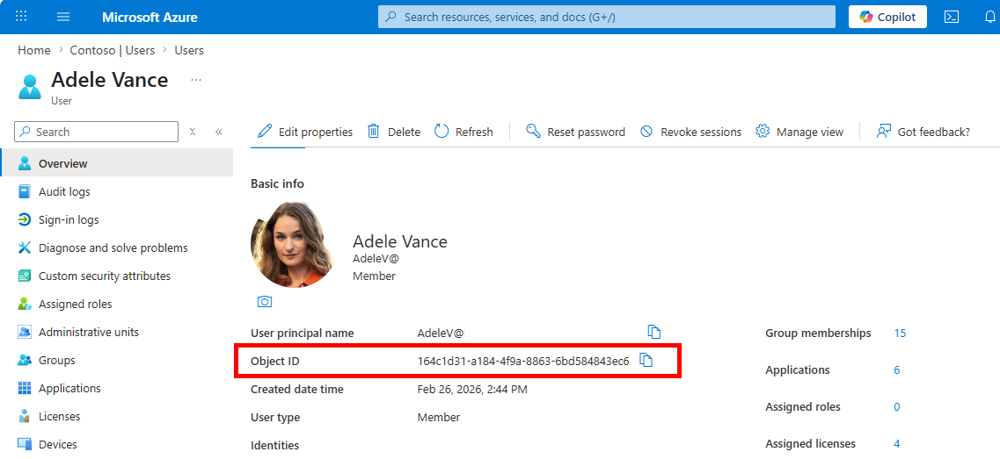
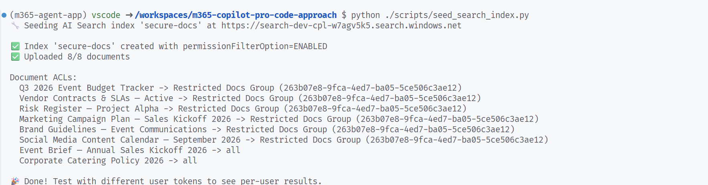

# Data and search

This project uses Azure AI Search with Entra group-based document permissions. To test the
application, you need to populate the search index with sample documents whose access is
restricted by group membership.

Complete [GETTING_STARTED.md](./GETTING_STARTED.md) first so the Azure resources exist.

## Generate local environment variables

First, generate the local environment variables based on the azd environment outputs.

```bash
./scripts/gen_local_env.sh
```

This creates a `.env` file at the root of the project with the necessary environment variables.

## Install dependencies

```bash
cd src
uv sync
```

This will create a virtual environment in `src/.venv` and install the dependencies from the `pyproject.toml` file.

## Activate the virtual environment

Source the virtual environment to activate it, so the dependencies installed in the virtual environment are used instead of the system-wide Python packages:

```bash
source .venv/bin/activate
```

## Create an Entra security group and add users

In this accelerator, the sample documents are tagged with Entra security group IDs to demonstrate per-user access control. You need to have 2 Entra security groups to test this scenario. 
This section shows how to create an Entra security group and add users to it. If you already have a group and users, skip the group creation step and just add users to your existing group.

To set up per-user access, create an Entra security group and add users to it. If you already
have a group and users, skip the group creation step and just add users to your existing group.
Replace `<group-id>` and `<user-object-id>` with the actual IDs.

```bash
az ad group create --display-name "Contoso-RestrictedDocs" --mail-nickname "contoso-restricteddocs"
# Add your users to the Entra ID group
az ad group member add --group "<group-id>" --member-id "<user-object-id>"
```



## Seed the AI Search index with demo documents

For simplicity, you will use the same `.env` file used by the bot. The `seed_search_index.py` script reads the group ID from `.env` and uses it to set restricted document permissions. Public documents are tagged with `group_ids=["all"]`.

Inside the `.env` update the `CONTOSO_GROUP_RESTRICTED_DOCS_ID` variable with your Entra group Object ID you created or reused.

Then from the **root** of the project, run the following command to seed the AI Search index with demo documents:

```bash
cd .. # Go back to the root of the project
python ./scripts/seed_search_index.py
```

You should see something like this:



To deploy the app and test it, continue with [RUN_AND_DEPLOY.md](./RUN_AND_DEPLOY.md).
For how these ACLs are enforced at query time, see [AUTHENTICATION.md](./AUTHENTICATION.md).
