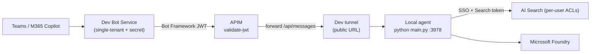

# Local development — dev tunnel behind APIM (full SSO)

This is the **only supported local test path**. It exercises the exact production flow —
real Bot Framework JWT validation at APIM, real SSO, and per-user AI Search ACLs — but
the agent code runs on your machine (in the dev container) instead of the App Service:



Why not rely on the Teams App Test Tool / Bot Service Web Chat for real testing? Both talk
to the agent directly and **cannot** go through APIM or perform the real SSO on-behalf-of
exchange, so they can't reproduce the JWT / per-user ACL behaviour. The Test Tool is still
useful as a quick **smoke test** (does the app boot and answer at all?) — see
[Mode A](#mode-a--anonymous-smoke-test-optional) at the bottom — but it is never a
substitute for this flow.

> Run everything inside the **dev container** (it has `az`, `azd`, `uv`, `python`, `node`,
> and — after rebuild — the `devtunnel` CLI). Bash scripts are primary; PowerShell
> equivalents (`.ps1`) are provided as a backup.

---

## Prerequisites

- The dev container (it installs the `devtunnel` CLI via the devcontainer feature).
- `az login` and `azd auth login` completed.
- Your test user is a member of the **Entra group** that grants document access — the
  real SSO flow puts that group membership into the Search token, so AI Search returns
  exactly the documents that user is allowed to see.

Use a dedicated azd environment for this loop so it never touches the shared/prod stack:

```bash
azd env new dev-tunnel
```

---

## One-time setup

```bash
# 1. Create the single-tenant dev bot app + secret (stored in the azd env).
#    Prod uses a managed identity, which a laptop cannot use to call the Bot Connector,
#    so the local loop needs an app + secret instead.
./scripts/provision_dev_bot.sh

# 2. Create a PERSISTENT dev tunnel for port 3978 and host it.
#    Writes LOCAL_TUNNEL_ENDPOINT + BOT_DOMAIN to the azd env. Leave it running.
./scripts/devtunnel.sh

# 3. In a second terminal, provision Azure. APIM's backend is set to the tunnel URL,
#    the Bot Service is registered single-tenant with the dev bot app, and the SSO +
#    Search OAuth connections are created.
azd provision

# 4. Generate src/.env for the local run (dev bot secret + Foundry/Search from outputs).
./scripts/gen_local_env.sh

# 5. Build and sideload the app package (BOT_ID points at the dev bot).
./scripts/build_manifest.sh
#    Upload appPackage/build/appPackage.dev-tunnel.zip in Teams
#    (Apps > Manage your apps > Upload a custom app) or M365 Copilot.
```

---

## Daily loop (no full deploy)

```bash
./scripts/devtunnel.sh          # terminal 1 — host the tunnel (same URL as yesterday)
cd src && uv run python main.py # terminal 2 — run the agent locally on :3978
```

Then chat with the agent in Teams / M365 Copilot. Set breakpoints / edit code and
restart `main.py` — no deploy needed.

**When do I need `azd provision` again?** Only if `LOCAL_TUNNEL_ENDPOINT` changed — the
`devtunnel.sh` script prints a `NOTE:` when it does. Because the tunnel id is reused, the
URL is normally stable, so a fresh `azd provision` is rarely needed (typically just once
in the morning if the tunnel was recreated).

---

## How it works (infra)

`infra/main.bicep` keeps the production topology unchanged by default. When the azd env
sets `LOCAL_TUNNEL_ENDPOINT` (+ `DEV_BOT_APP_ID`), it switches into dev-tunnel mode:

| Concern | Production | Dev tunnel |
| --- | --- | --- |
| APIM backend (`botBackendUrl`) | App Service URI | `LOCAL_TUNNEL_ENDPOINT` |
| Bot Service identity | UserAssignedMSI | SingleTenant app + secret (`DEV_BOT_APP_ID`) |
| Bot Framework JWT audience | MSI client id | dev bot app id |
| `BOT_ID` / `api://botid-…` | MSI client id | dev bot app id |
| Outbound Bot Connector auth | managed identity | client secret (local `.env`) |
| SSO / Search OAuth connections | FIC on SSO app | identical (FIC is bound to the OAuth connection, not the bot identity) |

Leaving `LOCAL_TUNNEL_ENDPOINT` empty (the default) reverts every one of these to the
production values, so normal `azd provision` / `azd deploy` is unaffected.

---

## Troubleshooting

- **401 at APIM** — the Bot Framework token audience must equal the dev bot app id. Make
  sure you ran `azd provision` *after* `provision_dev_bot.sh` and `devtunnel.sh`.
- **Bot replies never arrive** — the local `.env` `CLIENTSECRET` is stale. Re-run
  `./scripts/provision_dev_bot.sh` then `./scripts/gen_local_env.sh`.
- **`devtunnel: command not found`** — rebuild the dev container, or install manually:
  `curl -sL https://aka.ms/DevTunnelCliInstall | bash`.
- **No documents returned** — confirm your test user is in the expected Entra group and
  that `azd provision` granted your `az login` identity the AI Search data-plane role.

---

## Mode A — anonymous smoke test (optional)

A throwaway way to check the agent **boots and answers on its own**, with no Azure Bot,
no APIM and no SSO. Useful when iterating on agent/Foundry logic. It is **not** a
substitute for the dev-tunnel flow above: there is no per-user search token, so AI Search
returns public documents only.

```bash
az login
cd src
cp .env.local.example .env          # AGENT_AUTH_MODE=anonymous + ANONYMOUS_ALLOWED=true
#   edit MS_FOUNDRY_PROJECT_ENDPOINT (copy from `azd env get-values`)
uv run python main.py               # terminal 1 — agent on http://localhost:3978
../scripts/run-test-tool.sh         # terminal 2 — local chat UI
```

How it works: `AGENT_AUTH_MODE=anonymous` makes the app skip the SEARCH OAuth handler and
pass no search token, and `CONNECTIONS__SERVICE_CONNECTION__SETTINGS__ANONYMOUS_ALLOWED=true`
lets the SDK accept unauthenticated requests from the Test Tool. Foundry/Search use your
`az login` identity (`BOT_CLIENT_ID` left empty).
