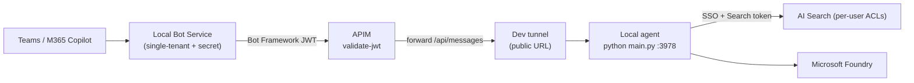

# Local development — dev tunnel behind APIM (full SSO)

This is the **only supported local test path**. It exercises the exact production flow —
real Bot Framework JWT validation at APIM, real SSO, and per-user AI Search ACLs — but
the agent code runs on your machine (in the dev container) instead of the App Service:



Why not rely on the Teams App Test Tool / Bot Service Web Chat for real testing? Both talk
to the agent directly and **cannot** go through APIM or perform the real SSO on-behalf-of
exchange, so they can't reproduce the JWT / per-user ACL behaviour. The Test Tool is still
useful as a quick **smoke test** (does the app boot and answer at all?) — see
[Mode A](#mode-a--anonymous-smoke-test-optional) at the bottom — but it is never a
substitute for this flow.

> Run everything inside the **dev container** (it has `az`, `azd`, `uv`, `python`, `node`,
> and the `devtunnel` CLI). All helper scripts are bash.

---

## Prerequisites

- The dev container (it installs the `devtunnel` CLI via the devcontainer feature).
- `az login` and `azd auth login` completed.
- Your test user is a member of the **Entra group** that grants document access — the
  real SSO flow puts that group membership into the Search token, so AI Search returns
  exactly the documents that user is allowed to see.

Use a dedicated azd environment for this loop so it never touches the shared/prod stack:

```bash
azd env new dev-tunnel
```

---

## One-time setup

The **local bot is always deployed** alongside the prod bot — there is no toggle. Its
single-tenant app registration is created by Bicep, and you (the deployer) are set as an
owner of it. Bicep cannot generate an Entra client secret, and
`Microsoft.Resources/deploymentScripts` is blocked on this subscription, so the secret is
minted locally by `gen_local_env.sh` with your own Azure identity (`az ad app credential
reset`) and cached in the azd env. Only the dev tunnel URL has to be created before
provisioning, so it can be wired as the local APIM backend.

```bash
# 1. Create a PERSISTENT dev tunnel for port 3978 and host it.
#    Writes LOCAL_TUNNEL_ENDPOINT to the azd env. Leave it running.
./scripts/devtunnel.sh

# 2. In a second terminal, provision Azure. This deploys the local bot
#    'bot-local-<suffix>' next to the prod bot, creates its app registration (you are set
#    as owner), adds the 'bot-local' APIM API (backend = tunnel), and creates the local
#    SSO + Search OAuth connections. The prod bot is left untouched.
azd provision

# 3. Generate src/.env for the local run. Mints the local bot client secret with your az
#    identity (cached in the azd env) and pulls Foundry/Search values from the outputs.
./scripts/gen_local_env.sh
```

> If you provision **before** creating the tunnel, `LOCAL_TUNNEL_ENDPOINT` defaults to the
> `https://localhost` placeholder and the local APIM backend won't reach your machine.
> Run `./scripts/devtunnel.sh` first, then `azd provision` (or re-provision after).

---

## Daily loop (no full deploy)

```bash
./scripts/devtunnel.sh          # terminal 1 — host the tunnel (same URL as yesterday)
cd src && uv run python main.py # terminal 2 — run the agent locally on :3978
```

Then chat with the agent in Teams / M365 Copilot. Set breakpoints / edit code and
restart `main.py` — no deploy needed.

**When do I need `azd provision` again?** Only if `LOCAL_TUNNEL_ENDPOINT` changed — the
`devtunnel.sh` script prints a `NOTE:` when it does. Because the tunnel id is reused, the
URL is normally stable, so a fresh `azd provision` is rarely needed (typically just once
in the morning if the tunnel was recreated).

---

## How it works (infra)

The prod bot is **never modified**. A separate local bot is always deployed alongside it —
there is no conditional toggle. Its single-tenant app registration is created by
`modules/security/local-bot-app-registration.bicep`, with the deployer set as an owner.
Bicep cannot generate an Entra client secret (secrets are write-only) and
`Microsoft.Resources/deploymentScripts` is blocked on this subscription, so the secret is
minted locally by `scripts/gen_local_env.sh` (`az ad app credential reset`) and cached in
the azd env (`LOCAL_BOT_APP_SECRET`). The only external input is `LOCAL_TUNNEL_ENDPOINT`
(from `devtunnel.sh`), used as the local APIM backend.

| Concern | Prod bot (`bot-<suffix>`) | Local bot (`bot-local-<suffix>`) |
| --- | --- | --- |
| Bicep module | `modules/bot/bot-service.bicep` | `modules/bot/bot-service-local.bicep` |
| Identity | UserAssignedMSI | SingleTenant app + secret (`LOCAL_BOT_ID`) |
| Secret source | n/a (managed identity) | minted locally by `gen_local_env.sh`, cached in azd env |
| APIM API / path | `bot-proxy` `/bot` | `bot-proxy-local` `/bot-local` |
| APIM backend | App Service URI | `LOCAL_TUNNEL_ENDPOINT` |
| Bot Framework JWT audience | MSI client id | local bot app id |
| Outbound Bot Connector auth | managed identity | client secret (local `.env`) |
| SSO / Search OAuth connections | on prod bot | on local bot, same SSO app + FIC (the FIC is bound to the connection unique id, not the bot) |

Both APIM APIs live on the same APIM instance (reusable `modules/apim/apim-bot-api.bicep`),
each validating its own audience and forwarding to its own backend. The local topology is
purely additive — the prod bot, its APIM API and OAuth connections are untouched, so a
normal `azd provision` / `azd deploy` of the prod stack is unaffected.

---

## Troubleshooting

- **401 at APIM** — the Bot Framework token audience must equal the local bot app id. Make
  sure you ran `azd provision` *after* `devtunnel.sh` so the tunnel URL is the APIM backend.
- **Bot replies never arrive** — the local `.env` `CLIENTSECRET` is stale or was rotated.
  Rotate it and regenerate `.env`:
  `azd env set LOCAL_BOT_APP_SECRET '' && ./scripts/gen_local_env.sh`, then restart the agent.
- **`gen_local_env.sh` can't create the secret** — confirm you are `az login`ed as an
  owner of the local bot app (the deployer is set as owner during `azd provision`) or as an
  Application Administrator in the tenant.
- **`devtunnel: command not found`** — rebuild the dev container, or install manually:
  `curl -sL https://aka.ms/DevTunnelCliInstall | bash`.
- **No documents returned** — confirm your test user is in the expected Entra group and
  that `azd provision` granted your `az login` identity the AI Search data-plane role.

---

## Mode A — anonymous smoke test (optional)

A throwaway way to check the agent **boots and answers on its own**, with no Azure Bot,
no APIM and no SSO. Useful when iterating on agent/Foundry logic. It is **not** a
substitute for the dev-tunnel flow above: there is no per-user search token, so AI Search
returns public documents only.

```bash
az login
cd src
cp .env.local.example .env          # AGENT_AUTH_MODE=anonymous + ANONYMOUS_ALLOWED=true
#   edit MS_FOUNDRY_PROJECT_ENDPOINT (copy from `azd env get-values`)
uv run python main.py               # terminal 1 — agent on http://localhost:3978
../scripts/run-test-tool.sh         # terminal 2 — local chat UI
```

How it works: `AGENT_AUTH_MODE=anonymous` makes the app skip the SEARCH OAuth handler and
pass no search token, and `CONNECTIONS__SERVICE_CONNECTION__SETTINGS__ANONYMOUS_ALLOWED=true`
lets the SDK accept unauthenticated requests from the Test Tool. Foundry/Search use your
`az login` identity (`BOT_CLIENT_ID` left empty).
