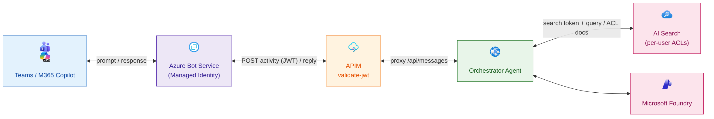
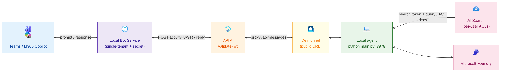
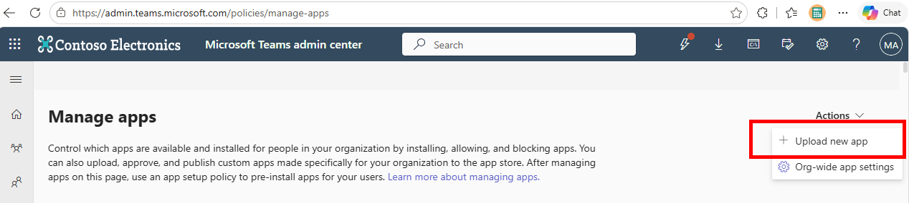
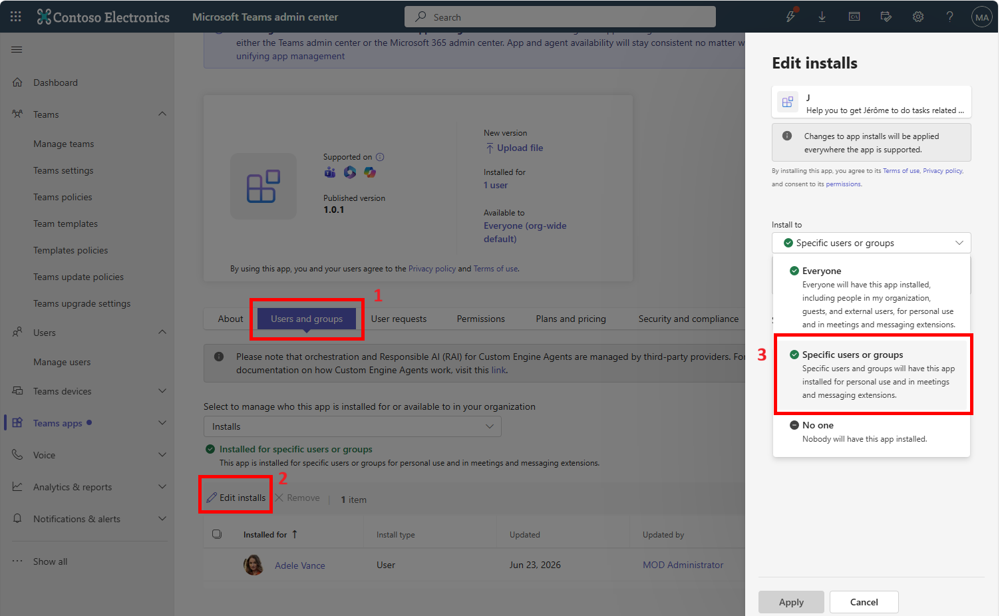
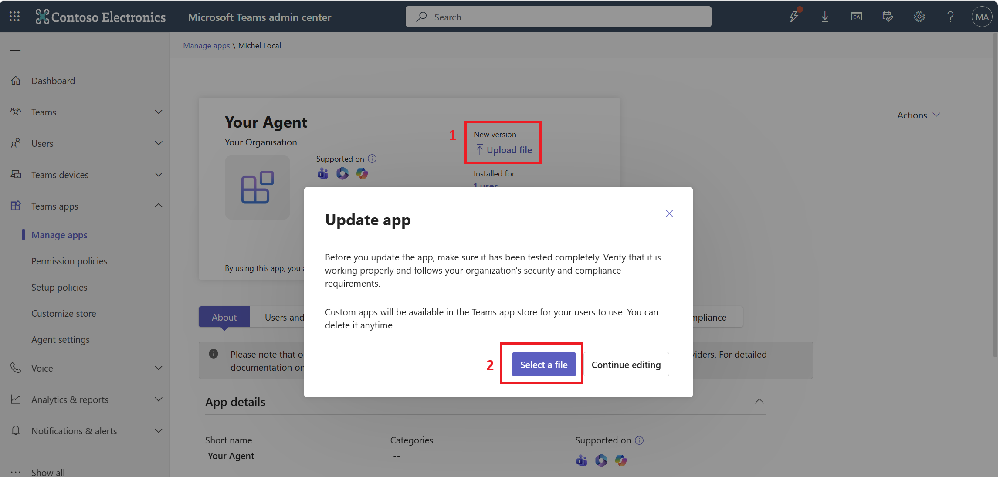

# Run and deploy

This guide covers running the agent (production and development modes) and publishing it to
Teams and Microsoft 365 Copilot.

Before starting, make sure you have:

1. Provisioned the Azure resources — see [GETTING_STARTED.md](./GETTING_STARTED.md).
2. Seeded the AI Search index — see [DATA_AND_SEARCH.md](./DATA_AND_SEARCH.md).

The two run modes and their identities are explained in
[ARCHITECTURE.md](./ARCHITECTURE.md#production-vs-development--debug-configuration):

- **Production mode** — deployed to Azure, real SSO + per-user ACLs.
- **Development / Debug mode** — local Bot Service + Dev tunnel, for breakpoints and fast iteration.

## Production mode



First, deploy the application to Azure:

```bash
azd deploy
```

The deployment should take a few minutes. If it takes longer than 5 minutes, cancel it and run the command again.

When it's deployed, generate the manifest package to upload to the Teams admin portal.

### 1. Create the Teams app id (one-time)

The Teams app id is a unique GUID identifying the app in the catalog. **Keep it stable** so future version bumps update the same app instead of creating a new one. Store it once in the azd environment:

```bash
# Only set it if it isn't already stored (idempotent)
azd env get-values | grep -q '^TEAMS_APP_ID=' || azd env set TEAMS_APP_ID "$(cat /proc/sys/kernel/random/uuid)"
```

- To force a brand-new id later: `azd env set TEAMS_APP_ID "$(cat /proc/sys/kernel/random/uuid)"`.

> Tip: run `export AZD_SKIP_UPDATE_CHECK=true` so azd's "update available" banner doesn't pollute `azd env get-value` output in scripts.

### 2. Build the manifest package

```bash
./scripts/build_manifest.sh \
  --app-version "1.0.0" \
  --teams-app-id "$(azd env get-value TEAMS_APP_ID)" \
  --bot-id "$(azd env get-value BOT_ID)" \
  --domain "$(azd env get-value APIM_DOMAIN)" \
  --app-uri "$(azd env get-value SSO_APP_ID_URI)" \
  --app-id "$(azd env get-value SSO_APP_ID)" \
  --short-name "YourAgent" \
  --full-name "YourAgent" \
  --zip appPackage.zip
```

This creates the `appPackage.zip` file in the `appPackage/build` folder.

Now follow the [Upload the app to Teams](#upload-the-app-to-teams) section.

## Development / Debug mode



<!-- Diagram source: docs/mermaids/architecture-development.mmd (regenerate the PNG with mermaid-cli) -->

To run the application in development/debug mode, you need to set up a dev tunnel and run the local agent.


<!-- Diagram source: docs/mermaids/architecture-development.mmd (regenerate the PNG with mermaid-cli) -->


First, log in to the dev tunnel:

```bash
devtunnel user login -d
```

Then run the dev tunnel script to create a persistent dev tunnel for port 3978 and host it. This writes the `LOCAL_TUNNEL_ENDPOINT` to the azd environment. Leave it running in the background.

```bash
./scripts/devtunnel.sh
```

In a **new terminal**, reprovision the Azure resources to update the local bot and APIM backend to use the dev tunnel endpoint:

```bash
azd provision
```

Generate `src/.env` for the local run. This mints the local bot client secret with your az identity (cached in the azd env) and pulls Foundry/Search values from the outputs.

```bash
./scripts/gen_local_env.sh
```

Finally, run the project locally:

```bash
cd src && uv run python main.py
```

### 1. Create the dev Teams app id (one-time)

The dev app is a **distinct** Teams app, so it uses its own GUID stored as `TEAMS_APP_ID_DEV`:

```bash
# Only set it if it isn't already stored (idempotent)
azd env get-values | grep -q '^TEAMS_APP_ID_DEV=' || azd env set TEAMS_APP_ID_DEV "$(cat /proc/sys/kernel/random/uuid)"
```

- To force a brand-new id later: `azd env set TEAMS_APP_ID_DEV "$(cat /proc/sys/kernel/random/uuid)"`.

### 2. Build the dev manifest package

```bash
./scripts/build_manifest.sh \
  --app-version "1.0.0" \
  --teams-app-id "$(azd env get-value TEAMS_APP_ID_DEV)" \
  --bot-id "$(azd env get-value LOCAL_BOT_ID)" \
  --domain "$(azd env get-value APIM_DOMAIN)" \
  --app-uri "$(azd env get-value LOCAL_SSO_APP_ID_URI)" \
  --app-id "$(azd env get-value LOCAL_SSO_APP_ID)" \
  --short-name "YourAgentDev" \
  --full-name "YourAgentDev" \
  --zip appPackage.dev.zip
```

Then upload the app package to Teams, following the [Upload the app to Teams](#upload-the-app-to-teams) section.

## Upload the app to Teams

Open [https://admin.teams.microsoft.com/policies/manage-apps](https://admin.teams.microsoft.com/policies/manage-apps) and sign in with your Microsoft 365 account.

Upload the `.zip` file you created in the previous step:



Then give access to your testing user or group:



By picking only one group or user, the propagation of the app will be faster.

## Update an existing app

When the app is already uploaded in the Teams admin center, keep the same Teams app id and only rebuild the package with a higher `--app-version`. Use `TEAMS_APP_ID` for the production app and `TEAMS_APP_ID_DEV` for the development/debug app; changing this id creates a new app instead of updating the existing one.

Open the existing app from **Teams apps > Manage apps**, then use **Upload file** in the **New version** section and select the new `.zip` package. This updates the same catalog app for both Teams and Microsoft 365 Copilot, while keeping the current user or group assignment.


