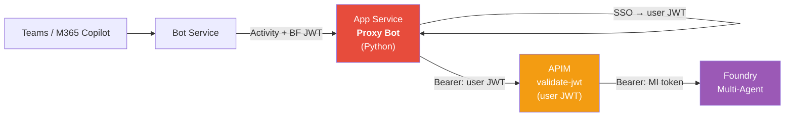
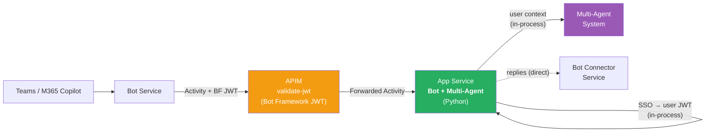
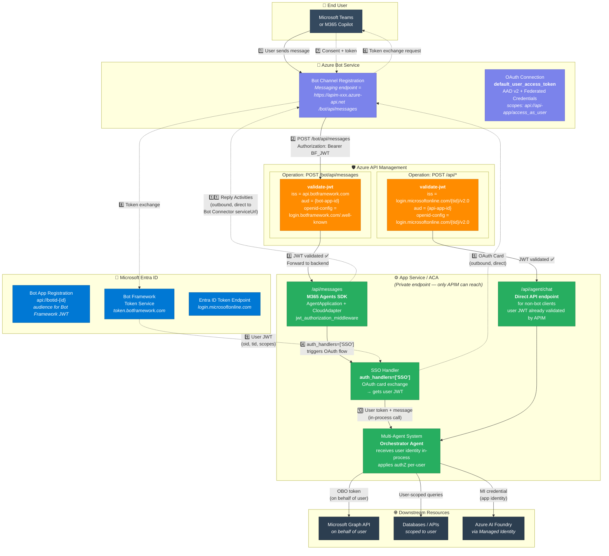
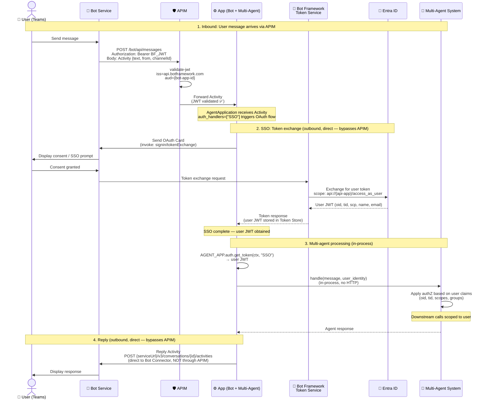
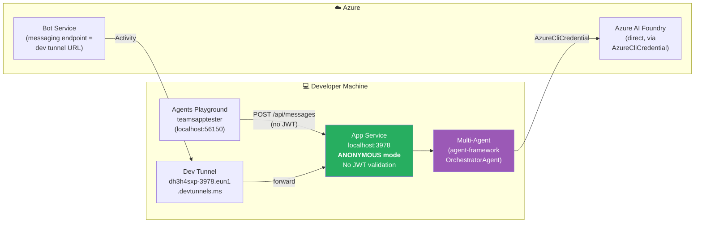
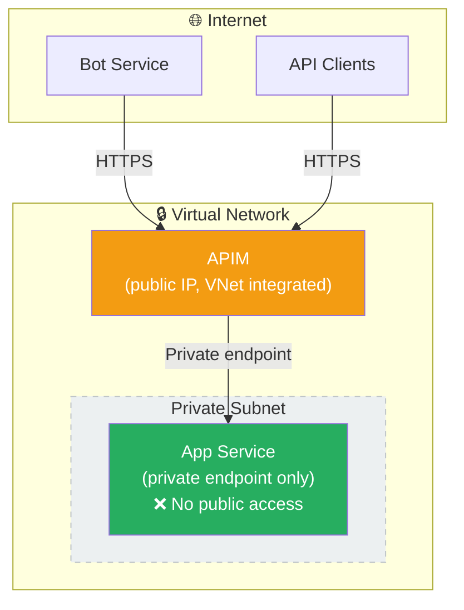

# Architecture v2 — Unified Bot + Multi-Agent behind APIM

> Grounded in Microsoft Learn documentation. All references are linked.

## Table of Contents

- [Current vs Proposed Architecture](#current-vs-proposed-architecture)
- [M365 Agents SDK — What We Should Use vs What Was Bricolé](#m365-agents-sdk--what-we-should-use-vs-what-was-bricolé)
- [Deployed Architecture (Detailed)](#deployed-architecture-detailed)
- [SSO Sequence Diagram](#sso-sequence-diagram)
- [Local Development Architecture](#local-development-architecture)
- [APIM Policy Design](#apim-policy-design)
- [Network Security](#network-security)
- [MS Learn References](#ms-learn-references)

---

## Current vs Proposed Architecture

### Current (v1) — Proxy Bot before APIM



**Problems:**
- Proxy bot is a separate app, duplicates boilerplate
- User JWT is forwarded externally through APIM (token exposure)
- APIM does a token swap (user JWT → MI) — complex policy
- Code uses internal SDK patches and custom `UserTokenCredential` class
- Two deployment targets to manage

### Proposed (v2) — Everything behind APIM, single app



**Benefits:**
- Single deployment (bot + multi-agent)
- User JWT stays in-process, never leaves the app
- APIM validates caller identity (Bot Framework JWT), not user tokens
- No token swap needed — app has direct access to resources
- Clean SDK usage, no monkey-patches

---

## M365 Agents SDK — What We Should Use vs What Was Bricolé

> Ref: [M365 Agents SDK Overview](https://learn.microsoft.com/microsoft-365/agents-sdk/agents-sdk-overview) |
> [Python Quickstart](https://learn.microsoft.com/microsoft-365/agents-sdk/quickstart) |
> [Migration Guide](https://learn.microsoft.com/microsoft-365/agents-sdk/bf-migration-python)

### SDK Classes to Use

| SDK Class | Purpose | Import |
|-----------|---------|--------|
| `AgentApplication[TurnState]` | Main app class, handles routing & auth | `microsoft_agents.hosting.core` |
| `CloudAdapter` | Channel adapter, handles Bot Framework protocol | `microsoft_agents.hosting.aiohttp` |
| `MemoryStorage` | Turn state storage | `microsoft_agents.hosting.core` |
| `Authorization` | OAuth/SSO flow management | `microsoft_agents.hosting.core` |
| `MsalConnectionManager` | MSAL-based auth connections | `microsoft_agents.authentication.msal` |
| `start_agent_process` | Processes incoming Activities | `microsoft_agents.hosting.aiohttp` |
| `jwt_authorization_middleware` | Validates incoming Bot Framework JWTs | `microsoft_agents.hosting.aiohttp` |
| `load_configuration_from_env` | Loads config from env vars | `microsoft_agents.activity` |
| `TurnContext` | Per-turn context (activity, send, streaming) | `microsoft_agents.hosting.core` |

### What Was Bricolé (To Remove)

| Bricolage | What it does | SDK replacement |
|-----------|-------------|----------------|
| `_OAuthFlow` monkey-patch | Catches `ValueError` on signin/failure invokes | **Fixed in newer SDK versions** — update SDK and remove patch |
| `UserTokenCredential` class | Wraps user JWT as `TokenCredential` for Azure SDK | **Not needed** — in v2, the user token stays in-process; multi-agent system receives user identity directly, not via Bearer token through APIM |
| Manual `load_configuration_from_env` + `MsalConnectionManager` wiring | Auth bootstrap | Use SDK's **standard `start_server` pattern** from quickstart |
| `_proxy_mode` / direct mode branching | Two code paths | **Single path** — bot always does SSO, always calls multi-agent in-process |
| `extra_body` with `agent_reference` | Injects Foundry agent reference into Responses API | **Still needed if using Foundry** — but can be encapsulated in a clean service class |
| Custom `server.py` with middleware hacks | JWT bypass for health/playground | Use SDK's standard **`start_server`** with `AgentAuthConfiguration` |

### Proper SDK Setup (from [Quickstart](https://learn.microsoft.com/microsoft-365/agents-sdk/quickstart))

```python
# start_server.py — SDK standard pattern
from microsoft_agents.hosting.core import AgentApplication, AgentAuthConfiguration
from microsoft_agents.hosting.aiohttp import (
    start_agent_process,
    jwt_authorization_middleware,
    CloudAdapter,
)
from aiohttp.web import Request, Response, Application, run_app

def start_server(
    agent_application: AgentApplication,
    auth_configuration: AgentAuthConfiguration,
):
    async def entry_point(req: Request) -> Response:
        return await start_agent_process(
            req, req.app["agent_app"], req.app["adapter"],
        )

    APP = Application(middlewares=[jwt_authorization_middleware])
    APP.router.add_post("/api/messages", entry_point)
    APP["agent_configuration"] = auth_configuration
    APP["agent_app"] = agent_application
    APP["adapter"] = agent_application.adapter
    run_app(APP, host="0.0.0.0", port=int(environ.get("PORT", 3978)))
```

```python
# app.py — clean AgentApplication with SSO
from microsoft_agents.hosting.core import (
    AgentApplication, TurnState, TurnContext, MemoryStorage, Authorization,
)
from microsoft_agents.hosting.aiohttp import CloudAdapter
from microsoft_agents.authentication.msal import MsalConnectionManager
from microsoft_agents.activity import load_configuration_from_env

config = load_configuration_from_env(environ)
connection_manager = MsalConnectionManager(**config)
adapter = CloudAdapter(connection_manager=connection_manager)
authorization = Authorization(MemoryStorage(), connection_manager, **config)

AGENT_APP = AgentApplication[TurnState](
    storage=MemoryStorage(),
    adapter=adapter,
    authorization=authorization,
    **config,
)

@AGENT_APP.activity("message", auth_handlers=["SSO"])
async def on_message(context: TurnContext, state: TurnState):
    # SSO already completed — get user token
    token = await AGENT_APP.auth.get_token(context, "SSO")
    # Pass user identity to multi-agent system (in-process)
    await multi_agent_system.handle(context, state, user_token=token.token)
```

### Auth Configuration ([Env Vars](https://learn.microsoft.com/microsoft-365/agents-sdk/bf-migration-python#configuration))

```env
# Required — Bot identity
CONNECTIONS__SERVICE_CONNECTION__SETTINGS__CLIENTID=<bot-app-id>
CONNECTIONS__SERVICE_CONNECTION__SETTINGS__CLIENTSECRET=<client-secret>
CONNECTIONS__SERVICE_CONNECTION__SETTINGS__TENANTID=<tenant-id>

# SSO handler
AGENTAPPLICATION__USERAUTHORIZATION__HANDLERS__SSO__SETTINGS__AZUREBOTOAUTHCONNECTIONNAME=default_user_access_token

# Connection map
CONNECTIONSMAP__0__SERVICEURL=*
CONNECTIONSMAP__0__CONNECTION=SERVICE_CONNECTION
```

---

## Deployed Architecture (Detailed)



---

## SSO Sequence Diagram

> Ref: [Bot SSO Overview](https://learn.microsoft.com/microsoftteams/platform/bots/how-to/authentication/bot-sso-overview) |
> [Bot Connector Authentication](https://learn.microsoft.com/azure/bot-service/rest-api/bot-framework-rest-connector-authentication)



---

## Local Development Architecture



**Local env:**
```env
# Anonymous mode (no auth needed for Playground)
CONNECTIONS__SERVICE_CONNECTION__SETTINGS__ANONYMOUS_ALLOWED=True

# Or with client secret for Teams via dev tunnel
CONNECTIONS__SERVICE_CONNECTION__SETTINGS__CLIENTID=<bot-app-id>
CONNECTIONS__SERVICE_CONNECTION__SETTINGS__CLIENTSECRET=<client-secret>
CONNECTIONS__SERVICE_CONNECTION__SETTINGS__TENANTID=<tenant-id>
```

---

## APIM Policy Design

### Operation 1: Bot Framework endpoint

```
Path: POST /bot/api/messages
Backend: https://{app-service}.azurewebsites.net/api/messages
```

```xml
<inbound>
    <!-- Validate Bot Framework JWT -->
    <validate-jwt header-name="Authorization" require-scheme="Bearer"
                  failed-validation-httpcode="401"
                  failed-validation-error-message="Unauthorized: Invalid Bot Framework token">
        <openid-config url="https://login.botframework.com/v1/.well-known/openidconfiguration" />
        <audiences>
            <audience>{{bot-app-id}}</audience>
        </audiences>
        <issuers>
            <issuer>https://api.botframework.com</issuer>
        </issuers>
    </validate-jwt>
    <set-header name="X-Forwarded-By" exists-action="override">
        <value>APIM-Bot</value>
    </set-header>
</inbound>
```

> Ref: [Bot Connector Auth — JWT structure](https://learn.microsoft.com/azure/bot-service/rest-api/bot-framework-rest-connector-authentication): `iss = https://api.botframework.com`, `aud = bot's Microsoft App ID`

### Operation 2: Direct API endpoint

```
Path: POST /api/agent/*
Backend: https://{app-service}.azurewebsites.net/api/agent/*
```

```xml
<inbound>
    <!-- Validate Entra ID user JWT -->
    <validate-jwt header-name="Authorization" require-scheme="Bearer">
        <openid-config url="https://login.microsoftonline.com/{{tenant-id}}/v2.0/.well-known/openid-configuration" />
        <audiences>
            <audience>{{api-app-id}}</audience>
            <audience>api://{{api-app-id}}</audience>
        </audiences>
    </validate-jwt>
</inbound>
```

> Ref: [APIM validate-jwt policy](https://learn.microsoft.com/azure/api-management/validate-jwt-policy)

---

## Network Security



The App Service is **not publicly accessible**. Only APIM can reach it through private endpoint / VNet integration.

---

## MS Learn References

| Topic | URL |
|-------|-----|
| M365 Agents SDK Overview | https://learn.microsoft.com/microsoft-365/agents-sdk/agents-sdk-overview |
| Python Quickstart | https://learn.microsoft.com/microsoft-365/agents-sdk/quickstart |
| Python Migration Guide | https://learn.microsoft.com/microsoft-365/agents-sdk/bf-migration-python |
| Bot SSO Overview | https://learn.microsoft.com/microsoftteams/platform/bots/how-to/authentication/bot-sso-overview |
| Bot Connector Authentication | https://learn.microsoft.com/azure/bot-service/rest-api/bot-framework-rest-connector-authentication |
| Activity Protocol | https://learn.microsoft.com/microsoft-365/agents-sdk/activity-protocol |
| APIM validate-jwt Policy | https://learn.microsoft.com/azure/api-management/validate-jwt-policy |
| User Authentication (Python) | https://learn.microsoft.com/microsoftteams/platform/teams-sdk/in-depth-guides/user-authentication |
| AgentApplication Class (Python) | https://learn.microsoft.com/python/api/microsoft-agents-hosting-core/microsoft_agents.hosting.core.app.agentapplication |
| Publish Agent to Teams | https://learn.microsoft.com/azure/ai-foundry/agents/how-to/publish-copilot?view=foundry |
