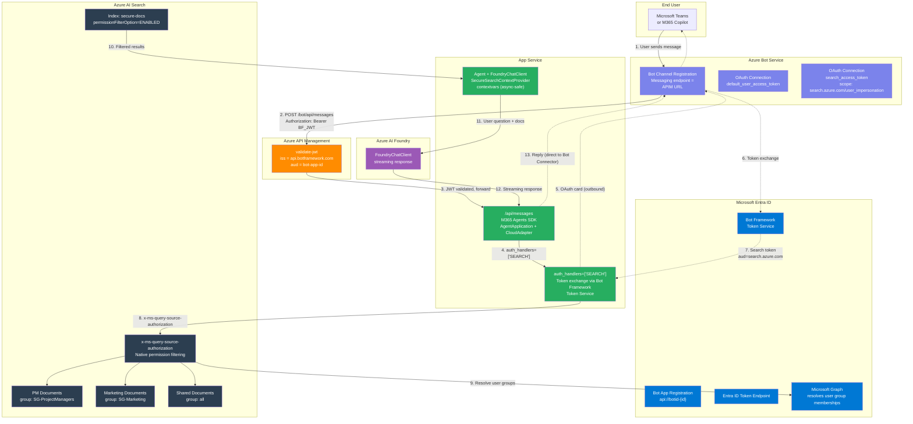
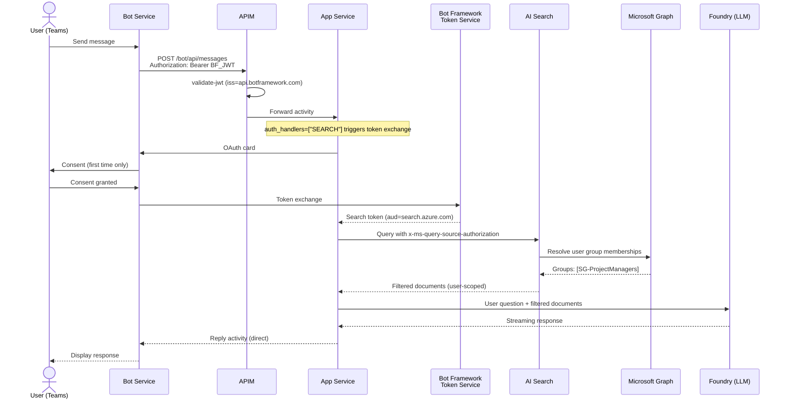

# Architecture

## Overview

This application exposes a multi-agent system as an M365 Copilot / Teams bot, secured behind Azure API Management with per-user document access control via Azure AI Search.



## Authentication Flow



## Per-User Document Filtering

Documents in AI Search have a `group_ids` field with `permissionFilter=GROUP_IDS`. When a user queries:

1. The App Service acquires a search token via the `SEARCH` auth handler (Bot Framework Token Service)
2. The search token (`aud=search.azure.com`) is passed to AI Search via `x-ms-query-source-authorization`
3. AI Search calls Microsoft Graph to resolve the user's Entra security group memberships
4. Only documents where `group_ids` matches one of the user's groups (or `"all"`) are returned
5. The agent uses only these filtered documents as context for the LLM

| Document | SG-ProjectManagers | SG-Marketing |
|----------|:------------------:|:------------:|
| Q3 Budget Tracker | ✅ | ❌ |
| Vendor Contracts & SLAs | ✅ | ❌ |
| Risk Register | ✅ | ❌ |
| Marketing Campaign Plan | ❌ | ✅ |
| Brand Guidelines | ❌ | ✅ |
| Social Media Calendar | ❌ | ✅ |
| Event Brief (shared) | ✅ | ✅ |
| Catering Policy (public) | ✅ | ✅ |

## APIM Policy

The Bot Framework JWT is validated by APIM before reaching the App Service:

```xml
<validate-jwt header-name="Authorization" require-scheme="Bearer">
    <openid-config url="https://login.botframework.com/v1/.well-known/openidconfiguration" />
    <audiences>
        <audience>{{bot-app-id}}</audience>
    </audiences>
    <issuers>
        <issuer>https://api.botframework.com</issuer>
    </issuers>
</validate-jwt>
```

Outbound replies from the bot go directly to the Bot Connector Service (`serviceUrl`), bypassing APIM.

## Key Design Decisions

| Decision | Rationale |
|----------|-----------|
| APIM in front of App Service | Network security — App Service can be private endpoint, only APIM reaches it |
| Bot Framework JWT validated by APIM | Ensures only legitimate Bot Service traffic reaches the app |
| Search token via Bot Framework Token Service | No client secrets needed — federated credentials handle the OBO exchange |
| `AzureAISearchContextProvider` subclass | The SDK doesn't yet support `x-ms-query-source-authorization` ([Issue #4878](https://github.com/microsoft/agent-framework/issues/4878)) |
| `contextvars` for search token | Async-safe per-request state — prevents cross-user token leaking |
| Per-conversation `AgentSession` | Preserves LLM conversation history without cross-user context leaking |

## References

| Topic | URL |
|-------|-----|
| M365 Agents SDK | https://learn.microsoft.com/microsoft-365/agents-sdk/agents-sdk-overview |
| Agent Framework (Python) | https://github.com/microsoft/agent-framework |
| AI Search Document-Level ACLs | https://learn.microsoft.com/azure/search/search-document-level-access-overview |
| Query-Time ACL Enforcement | https://learn.microsoft.com/azure/search/search-query-access-control-rbac-enforcement |
| Bot Connector Authentication | https://learn.microsoft.com/azure/bot-service/rest-api/bot-framework-rest-connector-authentication |
| APIM validate-jwt Policy | https://learn.microsoft.com/azure/api-management/validate-jwt-policy |
| Bot SSO Overview | https://learn.microsoft.com/microsoftteams/platform/bots/how-to/authentication/bot-sso-overview |
