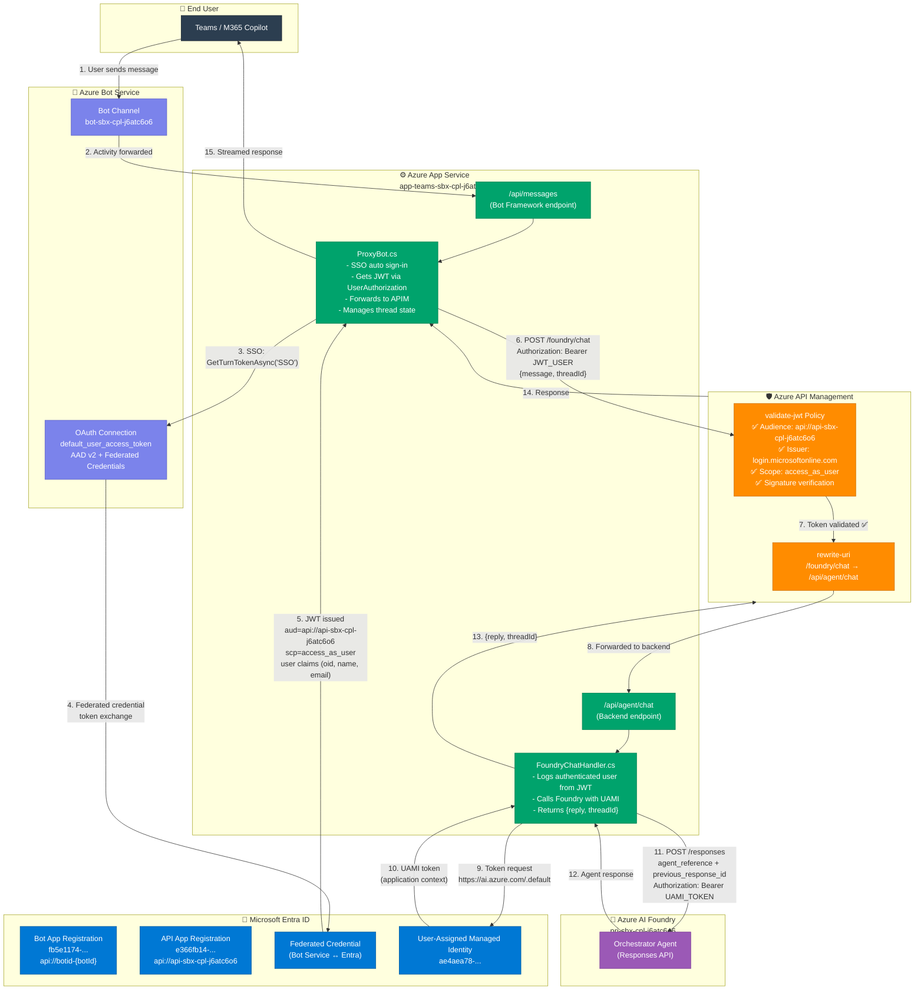

```mermaid
flowchart TB
    subgraph USER["👤 End User"]
        Teams["Teams / M365 Copilot"]
    end

    subgraph ENTRA["🔐 Microsoft Entra ID"]
        BotApp["Bot App Registration\nfb5e1174-...\napi://botid-{botId}"]
        ApiApp["API App Registration\ne366fb14-...\napi://api-sbx-cpl-j6atc6o6"]
        FedCred["Federated Credential\n(Bot Service ↔ Entra)"]
        UAMI["User-Assigned Managed Identity\nae4aea78-..."]
    end

    subgraph AZURE_BOT["🤖 Azure Bot Service"]
        Bot["Bot Channel\nbot-sbx-cpl-j6atc6o6"]
        OAuthConn["OAuth Connection\ndefault_user_access_token\nAAD v2 + Federated Credentials"]
    end

    subgraph APP_SERVICE["⚙️ Azure App Service\napp-teams-sbx-cpl-j6atc6o6"]
        direction TB
        BotEndpoint["/api/messages\n(Bot Framework endpoint)"]
        ProxyBot["ProxyBot.cs\n- SSO auto sign-in\n- Gets JWT via UserAuthorization\n- Forwards to APIM\n- Manages thread state"]
        BackendEndpoint["/api/agent/chat\n(Backend endpoint)"]
        FoundryHandler["FoundryChatHandler.cs\n- Logs authenticated user from JWT\n- Calls Foundry with UAMI\n- Returns {reply, threadId}"]
    end

    subgraph APIM["🛡️ Azure API Management\napim-sbx-cpl-j6atc6o6"]
        JWTPolicy["validate-jwt Policy\n✅ Audience: api://api-sbx-cpl-j6atc6o6\n✅ Issuer: login.microsoftonline.com\n✅ Scope: access_as_user\n✅ Signature verification"]
        Rewrite["rewrite-uri\n/foundry/chat → /api/agent/chat"]
    end

    subgraph FOUNDRY["🧠 Azure AI Foundry\nprj-sbx-cpl-j6atc6o6"]
        Agent["Orchestrator Agent\n(Responses API)"]
    end

    %% Flow
    Teams -->|"1. User sends message"| Bot
    Bot -->|"2. Activity forwarded"| BotEndpoint
    BotEndpoint --> ProxyBot
    ProxyBot -->|"3. SSO: GetTurnTokenAsync('SSO')"| OAuthConn
    OAuthConn -->|"4. Federated credential\ntoken exchange"| FedCred
    FedCred -->|"5. JWT issued\naud=api://api-sbx-cpl-j6atc6o6\nscp=access_as_user\nuser claims (oid, name, email)"| ProxyBot
    ProxyBot -->|"6. POST /foundry/chat\nAuthorization: Bearer JWT_USER\n{message, threadId}"| JWTPolicy
    JWTPolicy -->|"7. Token validated ✅"| Rewrite
    Rewrite -->|"8. Forwarded to backend"| BackendEndpoint
    BackendEndpoint --> FoundryHandler
    FoundryHandler -->|"9. Token request\nhttps://ai.azure.com/.default"| UAMI
    UAMI -->|"10. UAMI token\n(application context)"| FoundryHandler
    FoundryHandler -->|"11. POST /responses\nagent_reference + previous_response_id\nAuthorization: Bearer UAMI_TOKEN"| Agent
    Agent -->|"12. Agent response"| FoundryHandler
    FoundryHandler -->|"13. {reply, threadId}"| APIM
    APIM -->|"14. Response"| ProxyBot
    ProxyBot -->|"15. Streamed response"| Teams

    %% Styling
    classDef entra fill:#0078d4,color:#fff,stroke:#005a9e
    classDef bot fill:#7b83eb,color:#fff,stroke:#5b5fc7
    classDef app fill:#00a36c,color:#fff,stroke:#008055
    classDef apim fill:#ff8c00,color:#fff,stroke:#cc7000
    classDef foundry fill:#9b59b6,color:#fff,stroke:#7d3c98
    classDef user fill:#2c3e50,color:#fff,stroke:#1a252f

    class BotApp,ApiApp,FedCred,UAMI entra
    class Bot,OAuthConn bot
    class BotEndpoint,ProxyBot,BackendEndpoint,FoundryHandler app
    class JWTPolicy,Rewrite apim
    class Agent foundry
    class Teams user
```