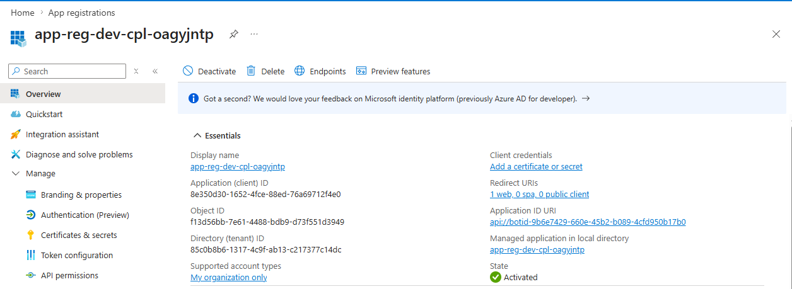
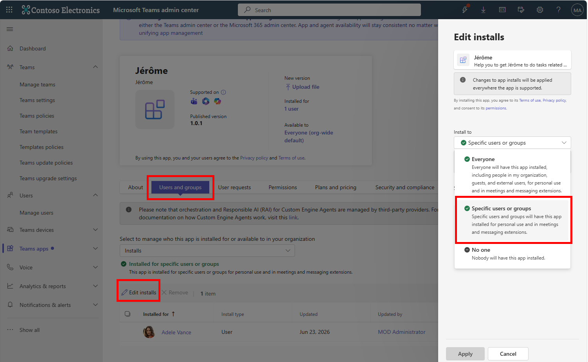

# Deploy the Teams/Copilot app

## Prepare the manifest

To be able to deploy the Teams/Copilot app, you need to prepare the manifest file. The manifest file is a JSON file that contains metadata about your app, including its name, description, icons, and the bot ID.

Inside the `appPackage/` folder, copy the `manifest.tpl.json` and rename it to `manifest.json`.

Then do the following replacements in the `manifest.json` file:

- Modify the `"id"` field to create your own unique app ID.
- Update the `${{BOT_ID}}` with the bot ID of your Azure Bot Service. You can find it inside the `Configuration` tab under `Microsoft App ID`.
- Update the `${{APP_SERVICE_DOMAIN}}` with the domain of your Azure App Service (e.g., `<app-service-name>.azurewebsites.net`).
- Update the `"webApplicationInfo"` section with your App Registration details. Replace `${{APP_REGISTRATION_CLIENT_ID}}` with your App Registration's Client ID (made with your deployment that you can find in his `Overview` tab) and `${{APP_REGISTRATION_ID_URI}}` with your App Registration's ID URI (e.g., `api://<app-registration-client-id>`):

## Package the app

When the `manifest.json` file is ready, you can package the app. To do this, create a `.zip` file that contains the following files (available inside the `appPackage/` folder):

- `manifest.json`
- `color.png` (the color icon for your app)
- `outline.png` (the outline icon for your app)

## Upload the app to Teams

To upload the app to Teams, follow these steps:

Open `https://admin.teams.microsoft.com/policies/manage-apps` and sign in with your Microsoft 365 account.

Upload the `.zip` file you created in the previous step:

Then give acces to your testing user or group:

By picking only one group or user, the propagation of the app will be faster.