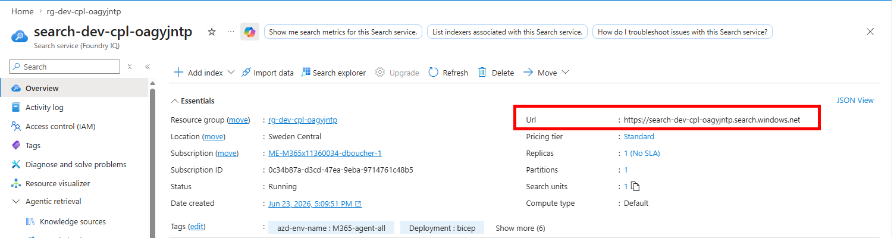

# Populate AI Search Index

## Per-user document access control

This project uses Azure AI Search with Entra group-based document permissions. To set it up:

### Create Entra security groups and add users

This section shows how to create demo groups and add users. You can use existing groups if you already have them. Replace `<group-id>` and `<user-object-id>` with the actual IDs.

```bash
az ad group create --display-name "Contoso-ProjectManagers" --mail-nickname "contoso-projectmanagers"
az ad group create --display-name "Contonso-Marketing" --mail-nickname "contoso-marketing"
# Add your users to the corresponding entra ID groups
az ad group member add --group "<group-id>" --member-id "<user-object-id>"
```


### Seed the AI Search index with demo documents

For simplicity, you will use the same `.env` file used by the bot. The `seed_search_index.py` script will read the group IDs from the `.env` file and use them to set the document permissions.

Inside the `.env` update the `AZURE_SEARCH_ENDPOINT` variable with your Azure AI Search endpoint. You can find it in the Azure portal under your Azure AI Search resource.



Then inside your `.env` update the `CONTOSO_GROUP_PM_ID` and `CONTOSO_GROUP_MKTG_ID` with the group IDs:

```bash
python src/scripts/seed_search_index.py
```

1. **Sideload the app in Teams/Copilot:**

Upload the manifest from `appPackage/` in Teams → Apps → Manage your apps → Upload a custom app.

## Configuration

All configuration is via environment variables. See [`.env.template`](src/.env.template).

| Variable | Description | Set by |
|----------|-------------|--------|
| `CONNECTIONS__SERVICE_CONNECTION__*` | Bot identity (UAMI) | `azd provision` |
| `AGENTAPPLICATION__USERAUTHORIZATION__HANDLERS__SEARCH__*` | Search token handler | `azd provision` |
| `AZURE_SEARCH_ENDPOINT` | AI Search endpoint | `azd provision` |
| `MS_FOUNDRY_PROJECT_ENDPOINT` | Foundry project endpoint | `azd provision` |
| `CONTOSO_GROUP_PM_ID` | Entra group ID for PM documents | Manual (`.env`) |
| `CONTOSO_GROUP_MKTG_ID` | Entra group ID for Marketing documents | Manual (`.env`) |